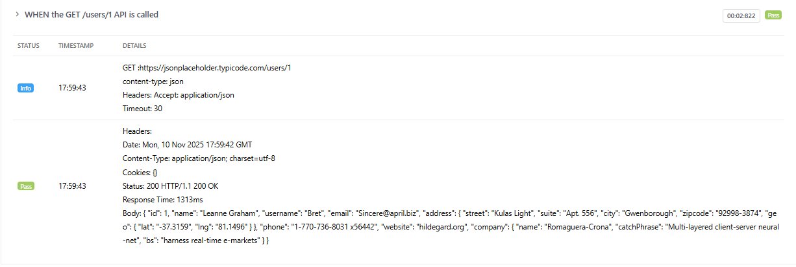
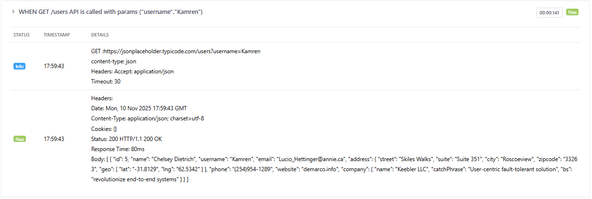
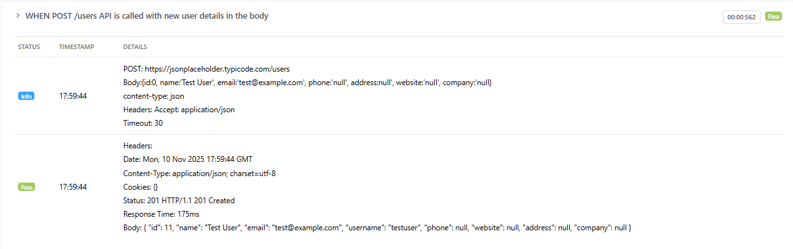
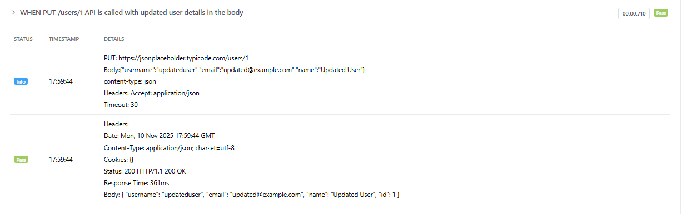
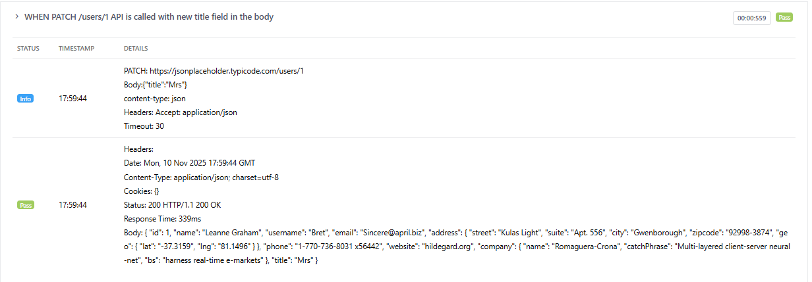
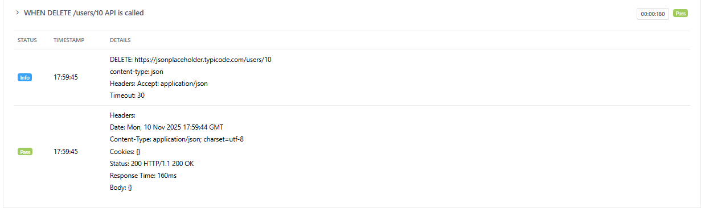
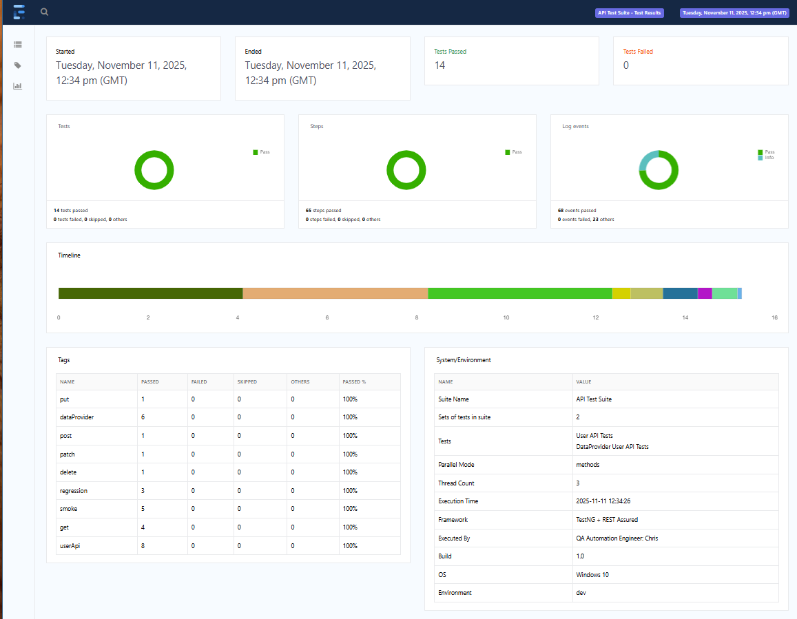
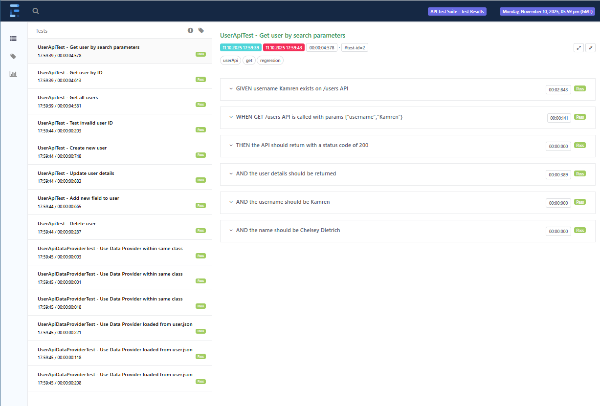
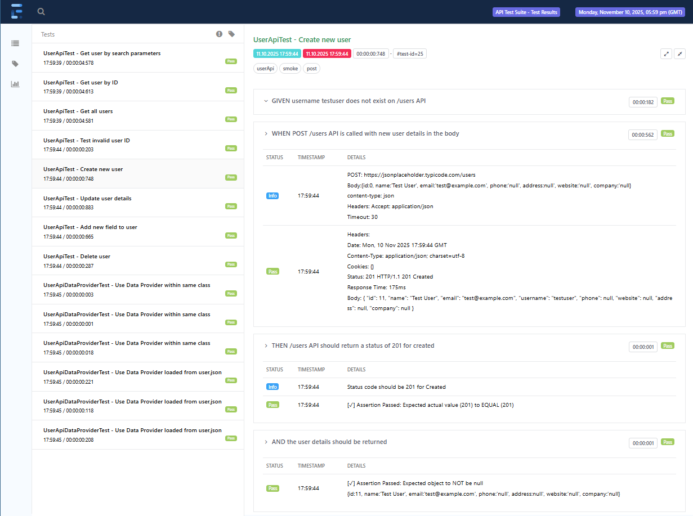
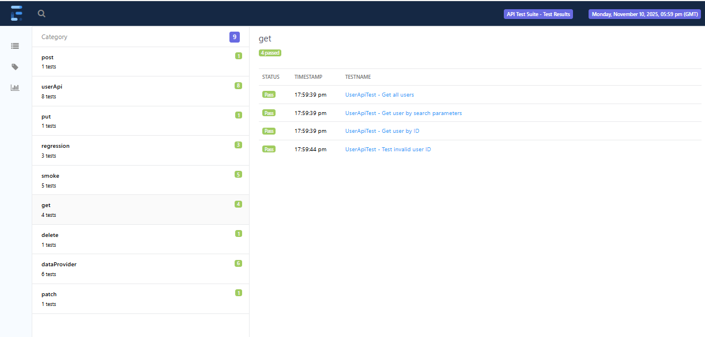

# RestAssured API Automation on TESTNG framework


[](https://github.com/CDTester/testNG-RestAssured/actions/workflows/restAssured.yml)
//[](https://github.com/CDTester/testNG-RestAssured/actions/workflows/pages/pages-build-deployment)

## Latest Build Report
https://cdtester.github.io/testNG-RestAssured/

## TestNG
### Annotations
| Annotation    | Description                                                                                                                                                                                                                                                                                                              | Parameters                                                                                                                                                                                                                                                                                                                                                                                                                                |
|---------------|--------------------------------------------------------------------------------------------------------------------------------------------------------------------------------------------------------------------------------------------------------------------------------------------------------------------------|-------------------------------------------------------------------------------------------------------------------------------------------------------------------------------------------------------------------------------------------------------------------------------------------------------------------------------------------------------------------------------------------------------------------------------------------|
| @BeforeSuite  | The annotated method will be run before all tests in this suite have run.                                                                                                                                                                                                                                                | (groups={"group1","group2"}): This attribute specifies the list of groups this class/method belongs to.<br/> (dependsOnGroups={"group1","group2"}): This attribute specifies the list of groups that this method depends on.                                                                                                                                                                                                              |
| @BeforeClass  | The annotated method will be run before the first test method in the current class is invoked.                                                                                                                                                                                                                           | (groups={"group1","group2"}) <br/>(dependsOnGroups={"group1","group2"})                                                                                                                                                                                                                                                                                                                                                                   |
| @BeforeTest   | The annotated method will be run before any test method belonging to the classes inside the <test> tag is run.                                                                                                                                                                                                           | (groups={"group1","group2"}) <br/>(dependsOnGroups={"group1","group2"})                                                                                                                                                                                                                                                                                                                                                                   |
| @BeforeGroups | The annotated method will be run before the first test method that belongs to any of these groups is invoked.                                                                                                                                                                                                            | (groups={"group1","group2"}) <br/>(dependsOnGroups={"group1","group2"})                                                                                                                                                                                                                                                                                                                                                                   |
| @AfterGroups  | The annotated method will be run after the last test method that belongs to any of these groups is invoked.                                                                                                                                                                                                              | (groups={"group1","group2"}) <br/>(dependsOnGroups={"group1","group2"})                                                                                                                                                                                                                                                                                                                                                                   |
| @AfterClass   | The annotated method will be run after all the test methods in the current class have been run.                                                                                                                                                                                                                          | (groups={"group1","group2"}) <br/>(dependsOnGroups={"group1","group2"})                                                                                                                                                                                                                                                                                                                                                                   |
| @AfterTest    | The annotated method will be run after all the test methods belonging to the classes inside the <test> tag have run.                                                                                                                                                                                                     | (groups={"group1","group2"}) <br/>(dependsOnGroups={"group1","group2"})                                                                                                                                                                                                                                                                                                                                                                   |
| @AfterSuite   | The annotated method will be run after all tests in this suite have run.                                                                                                                                                                                                                                                 | (groups={"group1","group2"}) <br/>(dependsOnGroups={"group1","group2"})                                                                                                                                                                                                                                                                                                                                                                   |
| @DataProvider | Marks a method as supplying data for a test method. The annotated method must return an Object[][] where each Object[] can be assigned the parameter list of the test method. The @Test method that wants to receive data from this DataProvider needs to use a dataProvider name equals to the name of this annotation. | (name="dataProviderName") <br/>(parallel=true/false)                                                                                                                                                                                                                                                                                                                                                                                      |
| @Parameters   | Describes how to pass parameters to a test method.                                                                                                                                                                                                                                                                       | (value={"param1","param2"})                                                                                                                                                                                                                                                                                                                                                                                                               |
| @Factory      | Marks a method as a factory that returns objects that will be used as TestNG test classes.                                                                                                                                                                                                                               |                                                                                                                                                                                                                                                                                                                                                                                                                                           |
| @Listeners    | Defines listeners on a test class or a suite.                                                                                                                                                                                                                                                                            | (value={ListenerClass1.class, ListenerClass2.class})                                                                                                                                                                                                                                                                                                                                                                                      |
| @Test         | The annotated method is a test method.                                                                                                                                                                                                                                                                                   | (alwaysRun=true/false) <br/>(enabled=true/false) <br/>(description="Test Description") <br/>(priority=1) <br/>(dependsOnMethods={"method1","method2"}) <br/>(dependsOnGroups={"group1","group2"}) <br/>(groups={"group1","group2"}) <br/>(dataProvider="dataProviderName") <br/>(dataProviderClass="dataProviderName") <br/>(successPercentage=80) <br/>(timeOut=milliseconds) <br/>(invocationCount=number) <br/>(threadPoolSize=number) |

### TestNG XML Suite Configuration
The testng.xml file is used to configure and organise TestNG test suites. Multiple testng.xml files can be created to run different sets of tests with different configurations. Below is an example of a basic testng.xml file:

testng_1.xml
```xml
<!DOCTYPE suite SYSTEM "https://testng.org/testng-1.0.dtd" >
<suite name="User API test suite" parallel="tests" thread-count="2">
    <test name="Smoke Tests" preserve-order="false">
        <groups>
            <run>
                <include name="smoke"/>
            </run>
        </groups>
        <classes>
            <class name="com.cdTester.restAssured.tests.user.UserApiTest"/>
            <class name="com.cdTester.restAssured.tests.user.AnotherClass"/>
        </classes>
    </test>
    <test name="Regression Tests">
        <groups>
            <run>
                <include name="regression"/>
            </run>
        </groups>
        <packages>
            <package name="com.cdTester.restAssured.tests.user"/>
        </packages>
    </test>    
</suite>
```

### Running TestNG Suite
To run the TestNG suite, you can use the following command in the terminal:

Using MVN
The following tells Maven to run the test using a specific testng.xml file and overrides the pom.xml groups.
```bash
mvn clean test -DsuiteXmlFile=testng_1.xml -Dgroups=
```

To run testNG methods in isolation from the intelliJ IDE, you need to add `VM options: -Denv=dev -Dgroups=` to run TestNG run configurations template.
On the main menu, select Run > Edit Configurations... > Edit template configurations... > TestNG
Now you can use the `Run Test` icon next to your @Test method.


## Configuration Management
The ConfigManager class is used to read configuration values from property files based on the environment specified. The environment is set using the 'env' system property, which can be passed as a VM option when running the tests.

The following example only contains one set of configuration for 'users' in the 'dev' environment. 
Config-dev.properties
```
# API Configuration Format
users.base.url=https://jsonplaceholder.typicode.com
users.timeout=30
#users.auth.type=none
#users.auth.type=X-API-Key
#users.auth.key=your-dev-api-key-here
#users.auth.type=bearer
#users.api.key=your-bearer-token
#users.auth.type=basic
users.username=user
users.password=pass

# Set default API
environment=dev
log.level=DEBUG
```
But it can also contain other configurations for other API resources by using different prefixes such as `jira.`, `aws.` etc.
This example also shows how to set different authentication types such as none, X-API-Key, bearer token and basic auth.


## API helper
The ApiClient class is a helper class that wraps the RestAssured library to provide a simplified interface for making API requests. It includes methods for setting base URIs, headers, query parameters, and body content, as well as methods for the following requests:
- GET
- POST
- PUT
- DELETE
- PATCH
The class also contains public variables that stores a string formatted request and response for logging purposes.

The ApiClient is called with your `@Test` method by passing in the ConfigManager class and the prefix for the configuration.
```java
ApiClient api = new ApiClient(config, "users");
```
Where config is an instance of the ConfigManager class that was instantiated in the `@BeforeTest` method in the BaseTest class.

This allows the ApiClient to read the base URI, endpoints, and any default headers or parameters from the configuration file.
```
Response search = api.get("/users/" + id);
given.info(api.request);
given.info(api.response);
```

### Get Request and Response Example
[](src/main/resources/docs/api_get.png)

### Get Request with parameters and Response Example
[](src/main/resources/docs/api_get_with_request_params.png)

### Post Request and Response Example
[](src/main/resources/docs/api_post.png)

### Put Request and Response Example
[](src/main/resources/docs/api_put.png)

### Patch Request and Response Example
[](src/main/resources/docs/api_patch.png)

### Delete Request and Response Example
[](src/main/resources/docs/api_delete.png)


## JSON utility
This project uses the Jackson library to handle JSON serialization and deserialization. The JsonUtil class provides static methods to convert Java objects to JSON strings and vice versa.
The two main methods are:
### deserialize(Response, Class<T>)
This method is used when the API response returns a single JSON object. 
This method takes a RestAssured Response object and the Class type of the POJO model for that API as parameters and returns an instance of the specified class populated with data from the JSON response.

### deserializeList(Response, Class<T>)
This method is used when the API response returns an array of JSON objects. 
This method takes a RestAssured Response object and the Class type of the POJO model for that API as parameters and returns an instance of the specified class populated with data from the JSON response.


## POJO models for the API response
The project includes POJO (Plain Old Java Object) models that represent the structure of the JSON responses from the API. These models are used in conjunction with the JsonUtil class to deserialize JSON responses into Java objects.


## Extent Reporter
### ExtentManager Class
An ExtentManager class has been created to facilitate the reporting of the test executions.
When this class is instantiated (in the baseTest class) by passing int the report file name and the XmlSuite object, the following information is extracted from the testng.xml to the report:
- Suite name
- Number of tests in the suite (not to be confused with test methods)
- Test names
- Parallel mode
- Thread count
- Execution start time
- Any parameters defined at the suite or test level (e.g. build number)
- Operating System
- Environment (from 'env' system property)

### BaseTest Class
The BaseTest.java does most of the heavy lifting for the reports. 
- @BeforeSuite: This is executed from <suite> tag in the testng.xml and will create the report directory if it does not exist. The ConfigManager is also instantiated here.
- @BeforeTest: This is executed from the <test> tag in the testng.xml and will set up the Extent report with values from the testng.xml.
- @BeforeMethod: This is executed at the start of every @Test annotation in your test files and adds the test details to the report.
- @AfterMethod: This is executed at the end of every @Test annotation in your test files and assigns the groups the tests belong to.
- @AfterSuite: This is executed at the end of the suite and cleans up the current extent report.
- extentStep(String stepName): This is called by the test to add Nodes to the extent report. This gives the report a test step appearance.
- A range of assertion functions that update the extentSteps.

### Test Classes
Each '@Test' method has the following properties that are used by the extent reporter:
- groups. These are used as extent report categories (or tags).
- description. This is used as the test case name in the report.

The tests then use the extentStep("step name") method to add steps to the report, these are assigned to a ExtentTest variable.
```
ExtentTest then = extentStep("THEN the API should return with a status code of 404");
```
By assigning it to a variable, the test can then use that variable to log info/pass/fail information to that step. E.g.
```
then.info("Status code should be 404 for Not Found");
```
Another way to assign a pass/fail to the step in by using any of the extentAssert methods in the BaseTest class.
```
extentAssertEquals(then, status, 404, "Status Code not as expected");
extentAssertTrue(given, search.getBody().asString().contains(username), "Response body should contain username " + username);
extentAssertFalse(given, search.getBody().asString().contains(username), "Response body should not contain username " + username);
extentAssertNotNull(thenAnd1, user, user.toString());
```

### Report Examples
The suite summary page shows the overall results of the suite execution along with the suite parameters and environment details.
[](src/main/resources/docs/extent_suite_summary.png)

The test page shows the details of each test including the steps, groups and any parameters.
[](src/main/resources/docs/extent_test_results.png)

Each step can be expanded to show more details including request and response information if logged in the test.
[](src/main/resources/docs/extent_test_step_results.png)

Finally, there is a tags page that shows all the groups/tags used in the suite and their results.
[](src/main/resources/docs/extent_tag_summary.png)

## 